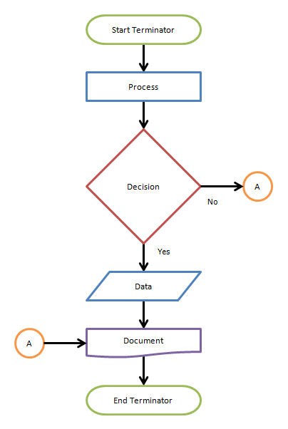
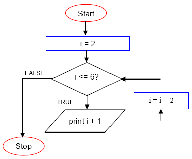

# Week 04 Day 5

## Topics

- [x] statements
  - conditionals
    - if-else
    - if-elseif-else
    - switch case
    - ternary operators
  - iterative statements
- [x] assigments
- [x] challenges

## Statements

- **Expression** - gives or returns o/p or gets i/p
- evaluation of expression is an **statement**
- two types of statements

## 1. Conditional Statemetns

- conditional - used to jump /skiparound in a code based on certain conditions

### Flow Charts

- flow charts that is, visual representation of how program goes/runs, step by step
- notice every type of box represent different stuff

  
  
- these are helpful to devise logical solutions of complex problems, that is *algorithms*

- syntax
  
  ```javascript
  if (condition) {
      // if true do this
  }
  else {
      // do this
  }
  ```

- 👉 code snippet
  
  ```javascript
  var pocketMoney = prompt("enter your pocket money ");
  var iceCream = 40;

  if (pocketMoney < 40) {
    console.log("no ice cream")
  } else {
    console.log("have some ice cream")
  }
  ```

- bear in mind in js it is preferred to use **camelCase**, it's a convention

- concatenation - joining two strings together
  
  ```javascript
  firstName = "rahul";
  lastName = "_choudhary";
  fullName = firstName + lastName; // output - rahul_choudhary
  ```

- parseInt

  ```javascript
  var pocketMoney_1 = prompt("enter money ");

  // Check if num is valid
  var isNotValid = isNaN(pocketMoney_1);

  if (isNotValid) {
      alert("invalid num");
  } else {
  alert("you have valid money");
  }
  ```

- use else if to introduce multiple conditions

### Nesting of Statements

- condition inside condition, external and internal, it can go upto many levels

### Switch Case

- selects code block to execute based on condition, always use break to avoid running all conditions
- syntax

  ```javascript
  switch(expression) {
  case x:
    // code block
    break;
  case y:
    // code block
    break;
  default:
    // code block
  }
  ```

### Ternary Operator

- short hand to write if else conditiional statements

  ```javascript
  // condition ? exprIfTrue : exprIfFalse;
  ```

## 2. Iterative Statements

- iterative statements are used to repeat same code block again and again, as and when required
- two types
  - entry check - for loop (fig below), while loop

  

  - entry check loops - check before getting inside loop body, may not even run once
  - exit check - do while
  - syntax

    ```javascript
    for (conditions) {
      // do this
    }
    ```
  
  - while loop
  
  ```javascript 
  while (i < 10) {
  text += "The number is " + i;
  i++;
  }
  ```

- exit check - check after getting inside the loop body, always runs once
- do while
  
  ```javascript
  var text = "";
  var i = 0;
  do {
    text += "The number is " + i;
    i++;
  }
  while (i < 5);
  ```

## Terms

- **keyword** - reserved previously by programming language
- **algorithms** - step by step
- **block** - pair of opening/closing curly braces is called code block
- **NaN** - used for error validation

---
